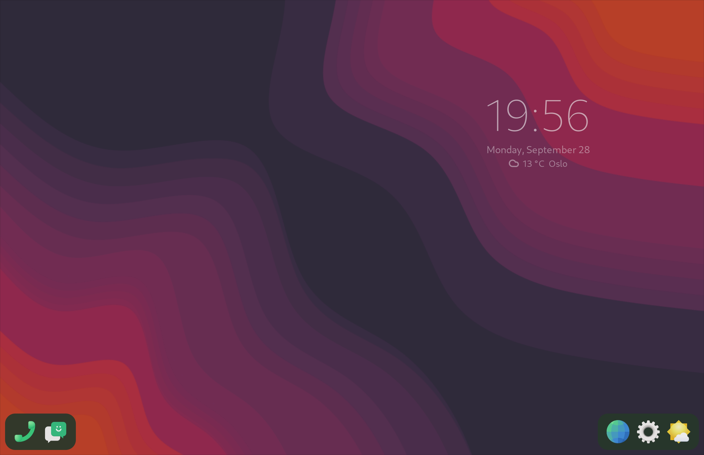
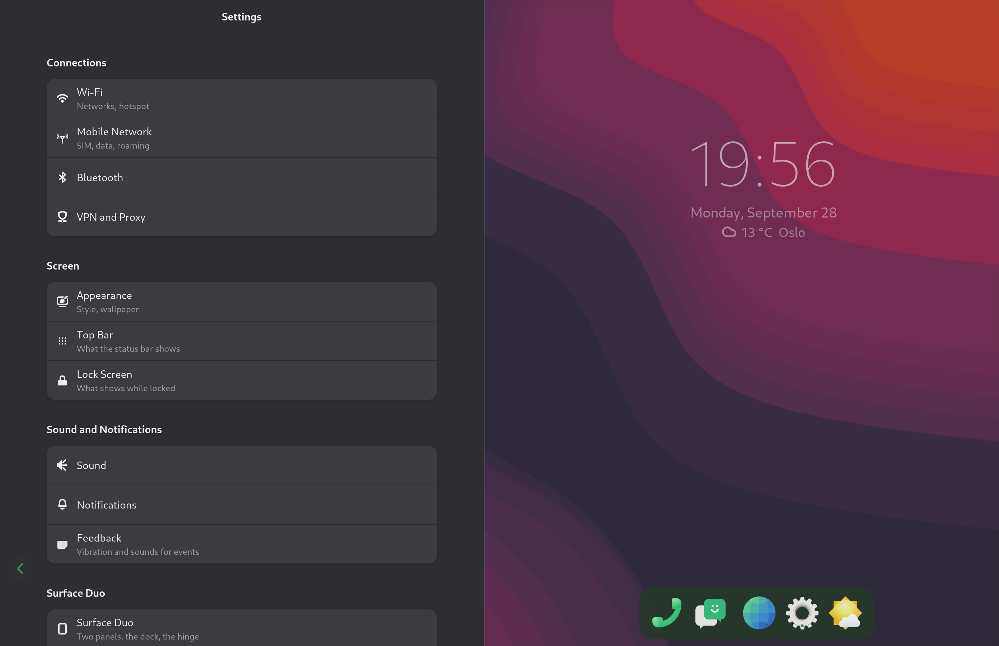
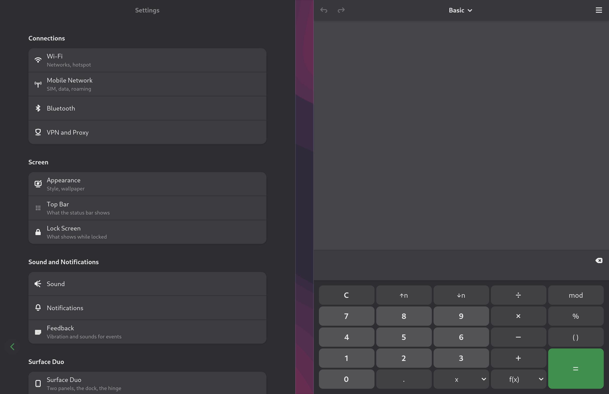
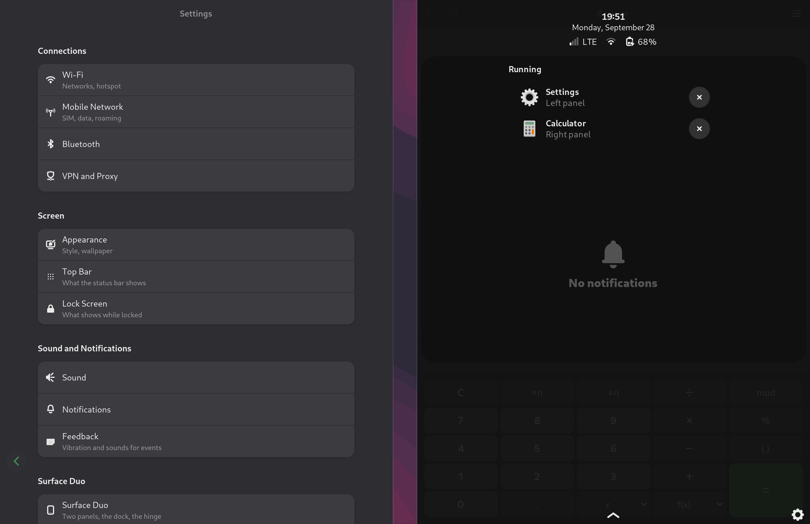
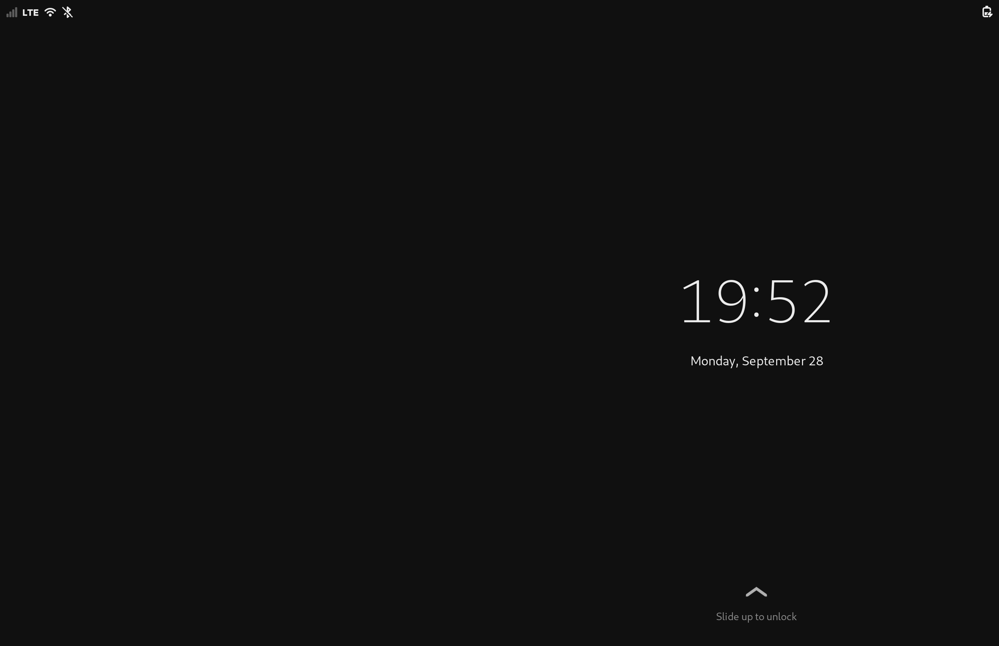

# item - a two-panel shell for the Surface Duo

**item-shell** is a shell for a phone with two screens and a hinge between
them, made on the Microsoft Surface Duo 1 running Droidian. It goes on top of
the port, [iverbovoy/surfaceduo-droidian](https://github.com/iverbovoy/surfaceduo-droidian),
which runs Droidian's own phosh on the two panels by itself; item-shell
turns that into a desktop made for two panels.

The shell is **experimental and in development**.

## What it looks like

Screenshots of the one output both panels share (2784x1800; the 84 px column
the hinge hides is in the middle), at the port's output scale of 2.

| | |
|---|---|
|  |  |
| Nothing open: the dock in two halves at the panels' outer edges, under the thumbs, and the time, the date and the weather on the right panel. No status bar outside the lock screen. | Settings on the panel it was opened on: the pages that apply to this phone, grouped, with its own Surface Duo page (the two-panel shell, the output scale, idle blanking) at the end. Back is the arrow in the corner under the thumb; the clock and the dock move to the free panel. |
|  |  |
| A window on each panel, each at its panel's full height: with both panels taken the dock and the clock step aside. | The right-hand shade: the clock, the date, signal, Wi-Fi and battery, the open windows with the panel each is on, and the notifications. The left-hand one holds the settings. |
|  | |
| The lock screen; 55-60 fps on the unlock swipe at scale 2. | |

## What it adds

- **A dock across both panels** that is also the desktop: an app launched
  from it opens on the panel it was launched from, tiled to that panel; a
  window can be minimized to it and called back, or sent to the other panel.
- **A shade per half, each with its own job**: settings on the left; the open
  windows, the phone's state and the notifications on the right. Either
  folds down from anywhere on its panel.
- **One window, the whole panel**: the bar moves to the free panel, and there
  is no status bar outside the lock screen.
- **The system screen** left of the left panel (clock, weather, calendar,
  the device) and **the pen's sheet** right of the right one, brought in by a
  swipe from the outer edge.
- **Settings in one column** on one panel, grouping the pages of GNOME
  Settings and Mobile Settings that apply to this phone.
- **Motion**: windows close, minimize and cross between panels with an
  animation, and the volume shows as an upright bar beside the keys.

[docs/SHELL.md](docs/SHELL.md) has what each of these does and why.

## Installing

item-shell 0.1.0 needs the port, 0.21.0 or later, on Droidian 102:

```
sudo apt install ./item-shell_0.1.0_arm64.deb
sudo systemctl restart phosh
```

Removing it gives Droidian's own shell on two panels back:

```
sudo apt remove item-shell
sudo systemctl restart phosh
```

## What is in this repository

| | |
|---|---|
| `shell/` | the dock, the system screen, the pen's sheet, `sfduo-shell` (the shell's switch) and its polkit policy |
| `apps/` | Settings in one column (`sfduo-settings`) and the launchers that send GNOME Settings and Mobile Settings to it |
| `css/` | the shell's CSS rules, appended to the port's by its `sfduo-shell-css` |
| `dconf/` | phoc's auto-maximize off: the dock tiles windows itself |
| `patches/` | phoc, phosh and the on-screen keyboard: the shell's patches, on top of the port's set |
| `package/` | `build.sh`, which makes `item-shell_<version>_arm64.deb` |
| `tests/` | the running-apps grouping and the dock's placing, without a phone |
| `tools/` | `sfduo-perfcheck`: the shell's frame times against thresholds, on the phone |
| `docs/` | [SHELL.md](docs/SHELL.md), [SETTINGS.md](docs/SETTINGS.md) |

## License

See [LICENSE](LICENSE).
