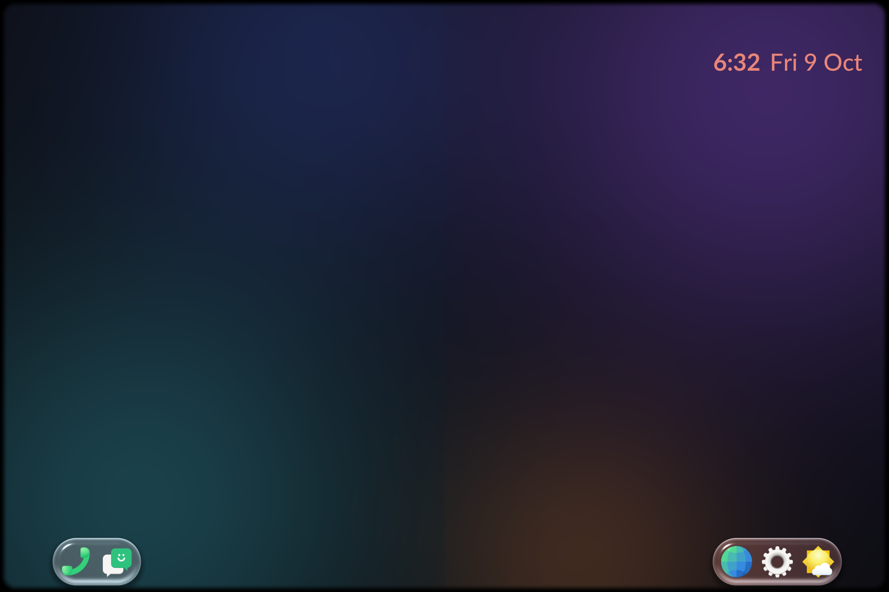
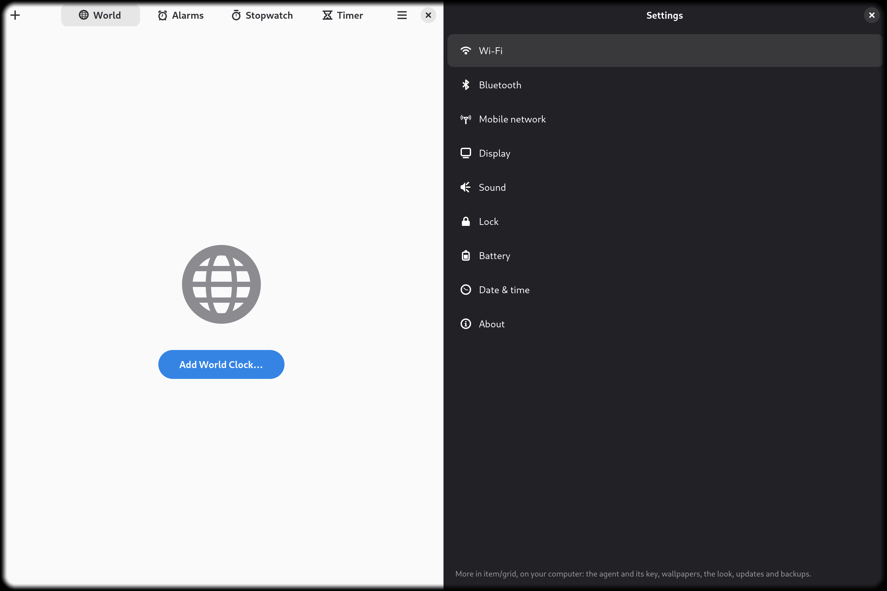
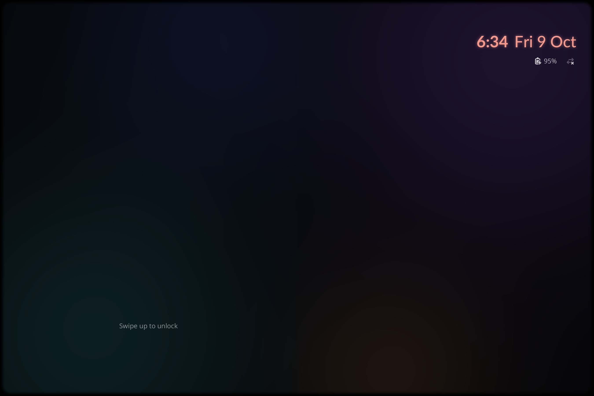
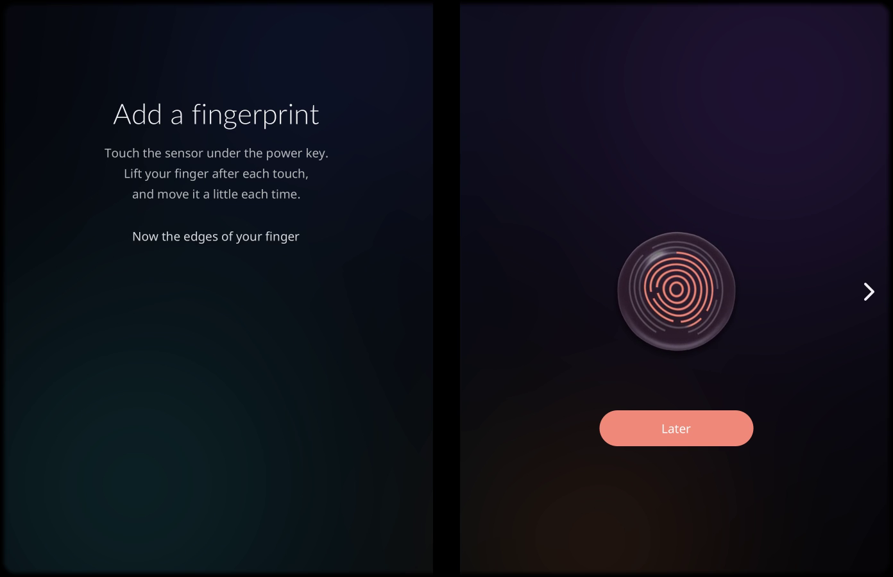
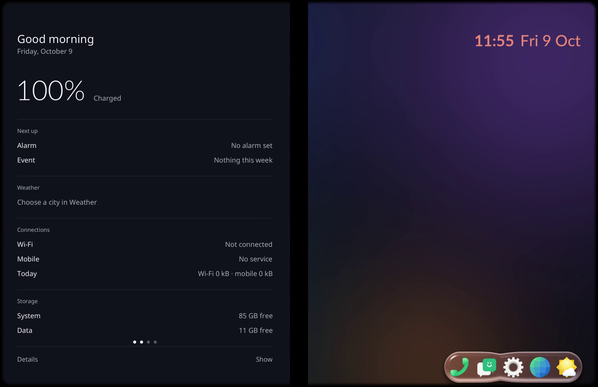
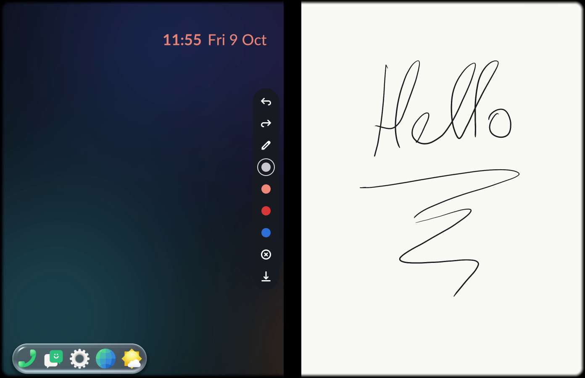

# item

**item** is a shell for a phone with two screens and a hinge between them,
made on the Microsoft Surface Duo 1 running Droidian. It is a Wayland
compositor of its own, `item-compositor`, that draws straight into the
phone's hwcomposer with the whole shell - the dock, the shades, the lock
screen, the screens at the edges - drawn inside it, in the same GPU pass as
the windows. It goes on top of the port,
[agentsco-lab/surfaceduo-droidian](https://github.com/agentsco-lab/surfaceduo-droidian),
and takes phosh's place; phosh stays installed as the way back.

**Until 1.0, item is an experiment.** It runs the owner's phone every day,
but nothing here is promised to work on yours: a release can break the lock
screen, the modem's sleep or the way back to phosh. Keep the port's backups,
install with a computer by the phone on the USB cable, and know
`sudo item-switch phosh`. What is done so far is the groundwork - the
compositor, its frame path, the gestures and the phone's sleep. Every app
and every menu you see will be reworked; they are there to make the phone
usable while that groundwork settles.

## What it looks like

A minute of it, both panels at 60 fps with the gap between them, filmed
from the compositor's own frames: the first setup (the PIN, a finger), the
tour, the shade, the system screen, the pen's sheet.

https://github.com/user-attachments/assets/3799c1b3-e2b0-46e7-925e-fc196ece50a8

Both panels as one picture, taken with `itemgrid screenshot` (2700x1800,
the hinge's strip left out) or as frames of the film (1392x900, the gap
black). The wallpaper is Aurora, drawn by the compositor itself.

| | |
|---|---|
|  |  |
| The desktop: the dock in two halves at the panels' outer edges, under the thumbs, and the clock on the free panel. | A window on each panel, each at its panel's full height: Clocks on the left, item Settings on the right. |
|  |  |
| The lock screen over the darkened wallpaper. A known face or finger unlocks it as the phone is opened. | The first setup, its finger step: the reader's mark under the power key fills as the finger is read. |
|  |  |
| The system screen, brought in from the left panel's outer edge: the battery, the next alarm and event, the connections, the storage. | The pen's sheet from the right panel's outer edge: strokes with the pen's pressure, four inks, undo and redo. |

## What it does

- **The dock** in two halves, under the thumbs. Its pieces are drops of
  water: they follow a finger, slosh along as the phone folds like a book,
  cross the hinge to the free panel and join. An app launched from it opens
  on the panel it was launched from; a window is put away with a swipe up
  from the panel's bottom edge and called back with a tap.
- **Windows by panel.** A window takes its whole panel, or both when carried
  across the hinge. There is no status bar.
- **A shade per panel**, glass over the screen: a status line, brightness,
  volume, quick settings and the player on the left; the open windows and the
  notifications on the right. **The system screen** left of the left panel
  (the battery with its 24 h graph, the calendar's next event, the device)
  and **the pen's sheet** right of the right one, brought in from the outer
  edge; the pen draws with its pressure, the other end erases.
- **The lock screen**: the PIN pad's keys as drops, the fingerprint mark at
  the reader under the power key. **CV ID**: a known face unlocks the phone
  as it is opened - the camera is started at the lid itself, ahead of the
  panels lighting. The faces enrolled stay on the phone, in
  `/var/lib/item-face`, root's alone; the camera is open only while the lock
  screen is lit.
- **The first setup** after a clean install: a welcome, a new PIN, a finger,
  a face, then a tour.
- **The phone's sleep** is item's: the lid darkens and lights the screen,
  asleep again 3 s after a wake that lit nothing, woken for alarms, an alarm
  or a call keeps the screen lit.
- **item Settings**: one window across both panels, the sections on the left,
  one page on the right, with the pages of GNOME Settings and Mobile Settings
  that apply to this phone opened in place.

## Measured

The same Duo 1, timed below both compositors with a uprobe on libhybris'
`hwc2_compat_display_present` - the call both make to hand hwcomposer a
frame (`compositor/log/2026-10-01-step-21-ab.md` and the two after it).

| | item 0.1 on phosh | item-compositor |
|---|---|---|
| a tap, from the touch to the present with the app's new frame | 17.6 ms (p90 24.4) | 6.2 ms (p90 7.9) |
| the shade pulled back up | 6 gaps over 25 ms each time, up to 54 ms | 0-1, up to 29 ms |
| the app grid going down | a 235-243 ms freeze each time | up to 34 ms |
| an animating app, its commit to the screen | not measurable (phoc reports no presentation) | one vsync, 15.8 ms |
| the shell at rest: memory (PSS) | 461 MB (phoc, phosh, dock, system screen, pen) | 173 MB |
| the shell at rest: CPU | 3.5 % of a core | 2.6 % |

Against the Lindroid chain (a virtual DRM device handing frames to
hwcomposer), the other way to run a compositor on this kernel: no CPU copy
of each frame (the chain spends 9-13 ms and 0.76 W on it at 60 fps), and
60 fps with both panels animating where the chain holds 30
([docs/COMPOSITOR.md](docs/COMPOSITOR.md)).

Other numbers: a frame of the shell renders in 1-1.5 ms; the shade follows
the finger 22-26 ms behind it where the same shade through GTK took about
39; a settings page opens in a tenth of a second where it took over one
([docs/SETTINGS.md](docs/SETTINGS.md)); CV ID takes about 135 ms a frame
on the Duo; a phone shut, Wi-Fi radio on and mobile data off, loses about
1.3 % an hour (0.16 W) with the port 0.22.0.

## How it is made

Rust throughout. The compositor is on [smithay](https://github.com/Smithay/smithay)
(calloop, its GLES renderer) with EGL on the Android platform - hwcomposer's
window, no GBM - and hands frames to hwcomposer through libhybris' hwc2 API,
with its vsync and fences; touch comes from libinput. Text is rendered
with fontdue into textures; D-Bus with zbus (logind, UPower, NetworkManager,
the notification server, polkit's agent, gnome-keyring's prompter); the PIN
through PAM; the session by gnome-session. CV ID runs YuNet, SFace and
MiniFASNetV2 as ONNX models with tract, the camera through GStreamer's
droidcamsrc, as a service of its own (`item-face`). item Settings is GTK4
and libadwaita. The on-screen keyboard is the port's stevia. All of it
ships as one Debian package built on the computer for aarch64
(`compositor/tools/package-deb.sh`).

How the compositor came to be, step by step with its measurements:
[docs/COMPOSITOR.md](docs/COMPOSITOR.md) and `compositor/log/`.

## What it needs, and what it changes

A Surface Duo 1 on Droidian 102 with the port 0.22.0 or later. item
disables `phosh.service` and runs `item.service` and `item-face.service` in
its place (`item-fallback.service` starts phosh if item does not come up);
it sets the kernel's alarm before sleeping, holds a wakelock while the screen
is lit, and keeps its state in `~/.config/item`. The faces enrolled are in
`/var/lib/item-face`, root's alone, and never leave the phone. Nothing of
Droidian's is removed.

## Installing

**With [item/grid](https://github.com/agentsco-lab/itemgrid)**, the way
meant for it. item/grid is the desktop program (Linux) that looks after a
connected Duo: it backs the phone up first, puts a
ready-made system image on it - Droidian 102, the port and item - RAM-boots
the port's kernel on a phone coming from stock Android and writes it to the
slots only once it booted there, and afterwards keeps item updated, reads
its logs and takes it back to stock Android if you want. Its window shows
the phone as it is held and one button for what to do now. It is the
computer by the phone that an experiment like this needs.

**By hand**, over a port 0.22.0 or later on Droidian 102:

```
sudo apt install ./item_0.2.1_arm64.deb
sudo item-switch item
```

The first start runs the setup. Back to Droidian's phosh, now and for the
boots after:

```
sudo item-switch phosh
```

`item-switch status` says which shell the phone starts.

## Where it stands

- Every app and menu is provisional: item Settings' pages, the shades'
  contents, the system screen and the pen's sheet will be reworked once the
  groundwork is done. Some of Settings' pages (networks and passwords among
  them) open the system's page for now.
- No wallpaper pictures ship yet: the desktop is Aurora, drawn by the
  compositor; the picker for one's own pictures is in the code, not in this
  release.
- Before the setup has run, and with a picture that cannot be read, the
  screen is black.
- Tried on one phone, the owner's. Each step was measured and tried by
  hand; there is no test suite beyond that.

## What is in this repository

| | |
|---|---|
| `compositor/` | item-compositor, its session, `item-face` (CV ID), `pen-split`, the package build (`tools/package-deb.sh`), the steps and measurements in `compositor/log/` |
| `apps/settings/` | item Settings (Rust, GTK4 and libadwaita), in the package |
| `docs/` | [COMPOSITOR.md](docs/COMPOSITOR.md), [SETTINGS.md](docs/SETTINGS.md), [SHELL.md](docs/SHELL.md) (item-shell 0.1 on phosh) |
| `docs/img/item-shell-0.1/`, [SHELL.md](docs/SHELL.md) | what is left here of item-shell 0.1, the shell as patches on the port's phoc and phosh (released as item-shell 0.1.0, 2026-09-29): its screenshots and its write-up. The code is in the branch and tag `item-shell-0.1`, superseded by the compositor |

## License

See [LICENSE](LICENSE).
