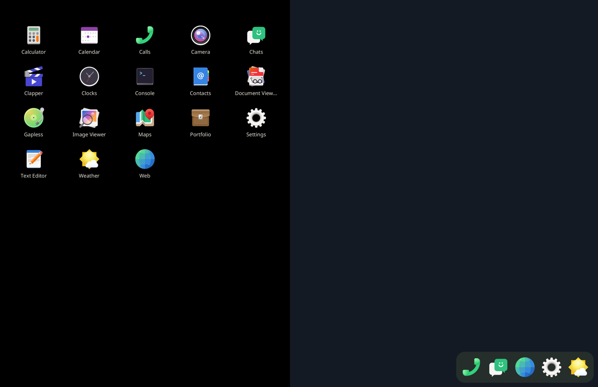

# Step 10: the app grid

item's "all apps" (sfduo-dock's GridPanel), drawn by the compositor
(`compositor/src/grid.rs`), with the apps read by a module the dock now
shares (`compositor/src/apps.rs`).

- Every app: the desktop files of `~/.local`, `/usr/local`, `/usr` and
  flatpak. Only Type=Application, not NoDisplay or Hidden, shown on a GNOME
  or Phosh desktop. Sorted by name: 18 on the phone.
- item's layout:
  - five columns, 14 px in from the sides, from 48 px down;
  - icons 48 px;
  - names in Noto Sans 12 px #e8e4d9, cut at 14 characters with "…";
  - 10 px above and below a cell, 6 px between rows;
  - black behind;
  - the pressed cell lit rgba(255,255,255,0.12) with 16 px corners.

  It is drawn at start into one texture, one panel's size, and after that
  only moved.
- A swipe up anywhere on an empty panel raises it with the finger: 55 % of
  the panel's height of travel opens it all the way (item's GRID_TRAVEL).
  It slides up whole. A swipe down there pulls the shade from where the
  finger started (item's desktop catcher; `Shade::grab_from`). 12 px of
  travel decides (SWIPE_PX).
- Let go: faster than 0.3 px/ms up opens, down closes; otherwise open past
  0.3. The rest takes 220 ms × what is left, easing out.
- On the grid, a swipe down closes it the same way. A tap on empty space
  closes it. A tap on an app closes it and launches the app onto the
  grid's panel under the curtain. If a window of the app was put away, it
  comes back instead, so apps not in the dock can now be brought back.
- While it is up, its panel counts as taken: the dock leaves it.
- Launching from the dock and from the grid is one path (`State::launch`).

A scripted run: swipe up on the left panel, a tap on Calculator. The
calculator's window drew 1.94 s after the tap.

Not yet:
- scrolling, since 18 apps fit in four rows;
- item's long press to add to or remove from the dock;
- running dots.
