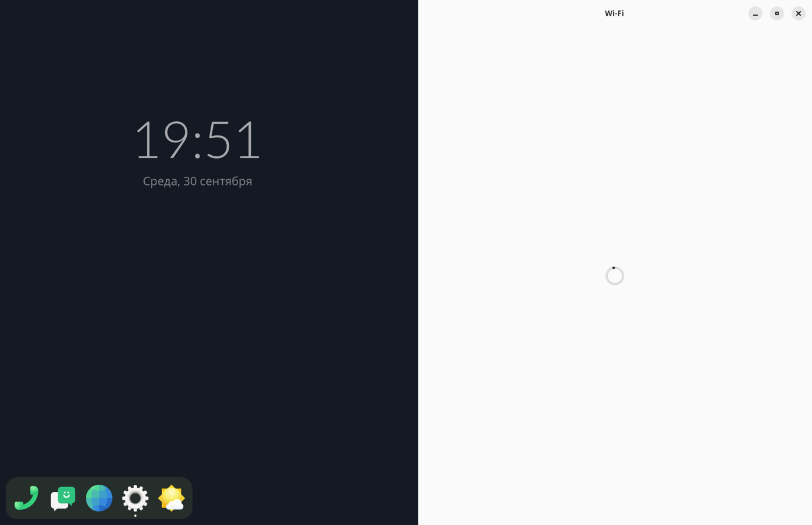
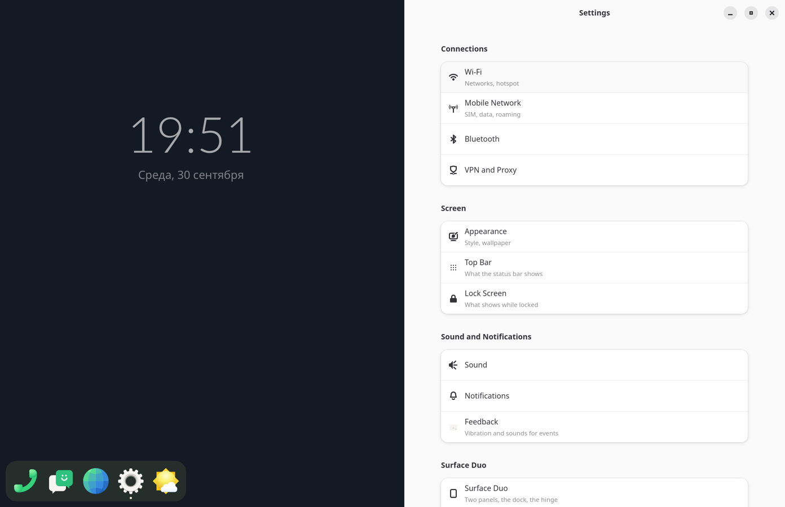
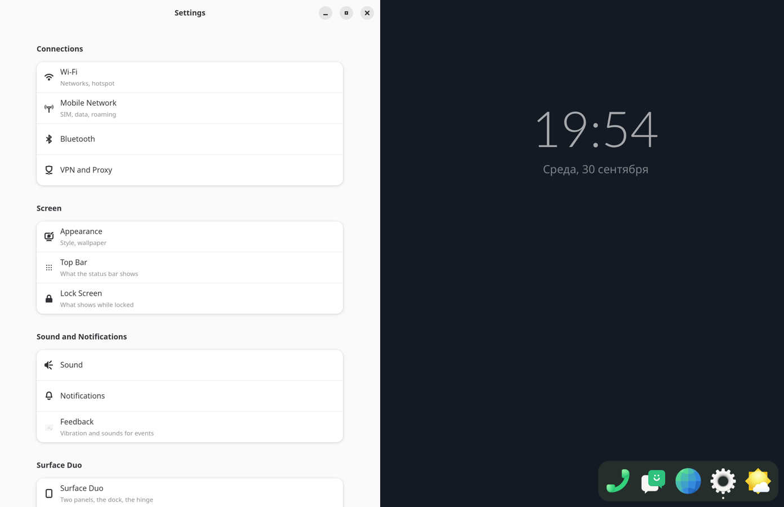

# Step 11: the desktop clock, running dots, back from the edge, an open app called over

Four of item's features, one after another, checked by scripted runs and
screenshots. They are to be tried by hand together.

## The desktop clock (`clock.rs`)

item's DesktopClock, since item has no status bar:
- the time (Lato Light 88 px, white at 62 %) and the date (Noto Sans 20 px,
  45 %) stand 20 % down the panel the dock stands on alone: the right one
  when both panels are free, none when neither is;
- each minute it steps up to 12 px from its place, against burn-in;
- the date is in Russian, as on the shade;
- no weather yet.

## Running dots

A 4 px dot, item's #e8e4d9, under each running app in the dock (in the
slab's bottom padding) and in the grid (under the name). An app runs if a
window of it is shown or put away (`State::running`, by app id).

## Back, from the edge (`back.rs`)

item's #80:
- a 14 px strip along the outer edge of a panel with a window (the left
  panel's left edge, the right panel's right edge), from 48 px down to
  above the bottom band;
- a round "<" (56 px) comes out with the finger at 0.7 of its travel, at
  most 0.9 of its size, and turns blue past 64 px;
- let go there and the panel's window gets the focus and Alt+Left, sent
  through the seat's keyboard as evdev KEY_LEFTALT and KEY_LEFT;
- terminals are left out by app id.

A scripted run: Settings open on the right, a tap on Wi-Fi, a drag in from
the right edge. `back: Alt+Left to org.sfduo.Settings`, and Settings went
back to its list:

## An open app, called to the other panel

Before, a tap in the dock on an app with a window open launched it again,
and the curtain waited 20 s for a window that never came. Now its window
comes to the tapped panel:
- it stands there at once and is drawn sliding across from the old one,
  260 ms eased in and out;
- it takes the focus;
- the dock and the clock go to the panel it left.

A scripted run: Settings open on the right, a tap on its icon in the dock
on the left.

