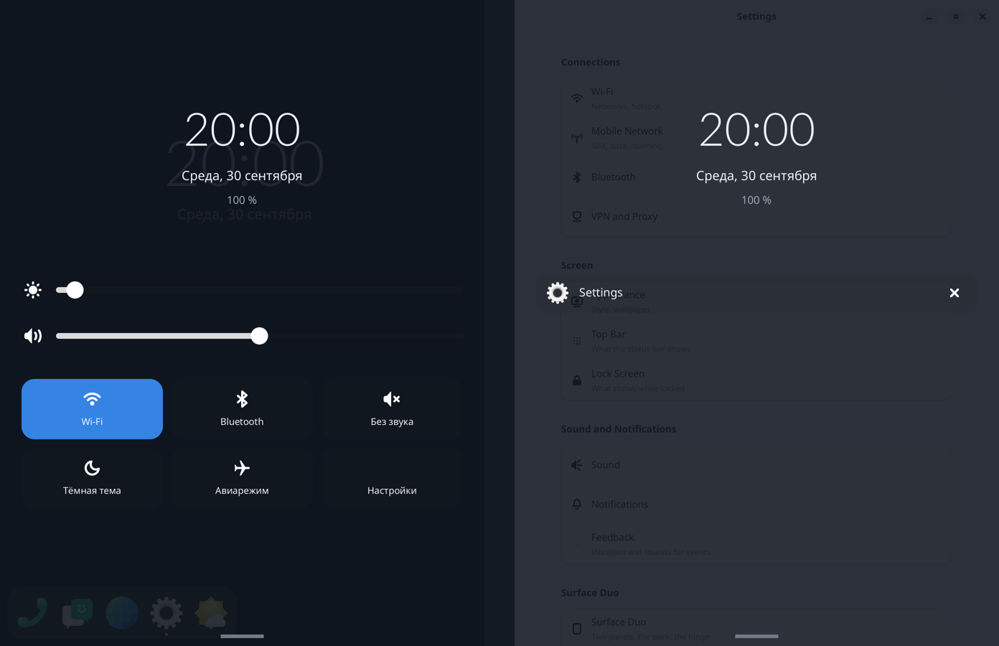
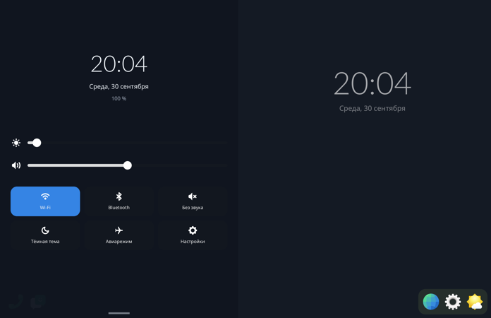

# Step 12: what the shades hold

item's split of the shades (patches/phosh/0003, "each shade has its own
job"), drawn by the compositor (`compositor/src/quick.rs`, `shade.rs`).

**The left shade, the settings:**
- brightness and volume sliders;
- six tiles: Wi-Fi, Bluetooth, mute, the dark style, airplane mode, and
  Settings, which opens item's Settings on that panel.

**The right shade, what is going on:** the open windows, shown and put
away, each a row with its app's icon and name and a close button (the
toplevel's close). Notifications and the media player are next.

**Both heads:** the time, the date and the battery, moved up to make room.

**How the system is read and set.** Everything runs on a thread of its
own, never in a frame. The loop is woken with a calloop ping when a read
is done.

| | read | set |
|---|---|---|
| brightness | sysfs `panel0-backlight` | logind `Session.SetBrightness` for both panels' backlights, as gsd-power does; checked: the call goes through from the session, no root |
| volume, mute | `pactl info` and `pactl list sinks` (this pactl has no `get-sink-volume`) | `pactl set-sink-volume`, `set-sink-mute` |
| Wi-Fi, airplane mode | `nmcli radio all` | `nmcli radio wifi/all` |
| Bluetooth | `rfkill list bluetooth` | `rfkill block/unblock bluetooth` (the user is in netdev, which owns /dev/rfkill) |
| dark style | `gsettings` `org.gnome.desktop.interface color-scheme` | the same |

A slider's value goes to the thread as the finger moves, and the thread
takes only the latest. Every command that changes something is logged
(`quick: ...`).

**Touches.** On a sheet at rest:
- a touch on a control works it: a slider follows the finger, a tile
  toggles on the release;
- a touch that moves 12 px becomes a pull of the sheet;
- a tap elsewhere on the sheet no longer closes it, since it holds
  controls now; a swipe does.

**The sheet** is now 97 % opaque. At 88 % the desktop clock and the
windows showed through the controls.

**The torch** (`led:torch_0`) is left out: its brightness reads 135 of 135
with the torch off, so on/off is not that file.

The tests did not toggle the phone's settings. The tiles and the volume
wait for a try by hand.
