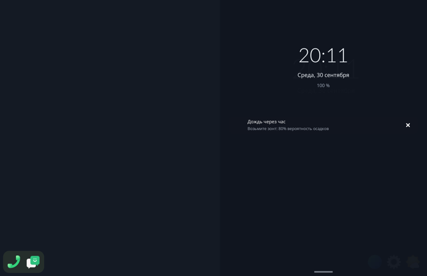

# Step 13: notifications

The compositor is the session's notification server
(`compositor/src/notify.rs`). It owns `org.freedesktop.Notifications` on
the session bus through zbus, which is free while phosh is stopped.

- `Notify`, `CloseNotification`, `GetCapabilities` (body, actions) and
  `GetServerInformation`. `NotificationClosed` is emitted with reason 2
  when the user dismisses one; `ActionInvoked "default"` when one with a
  default action is tapped.
- The icon, in order:
  - the `image-path` hint, which is where today's notify-send puts `-i`
    (app_icon came empty);
  - then `app_icon`;
  - then the `desktop-entry` hint's app.

  `file://` is stripped. The body is kept to its first line, markup
  removed.
- A new notification is a banner at the top of the right panel for 4 s: a
  card with the icon, the summary and the line of body, sliding in and out
  over 200 ms. A tap on it invokes it.
- The right shade lists the notifications, newest first, above the open
  windows. A tap on a row invokes it; the close button dismisses it.
- The bus runs on zbus's threads; the loop is woken by the same ping as
  the quick settings.

A run: `notify-send -a Weather -i org.gnome.Weather "Дождь через час"
"Возьмите зонт: 80% вероятность осадков"` during a session.

