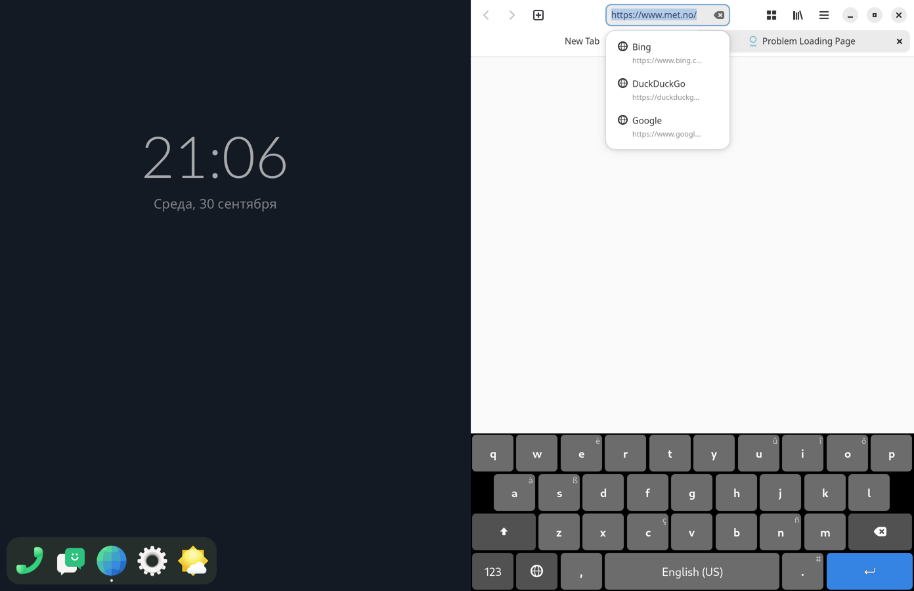
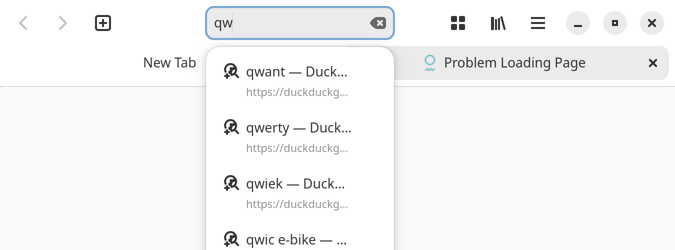

# Step 14: the on-screen keyboard

The port's keyboard, phosh-osk-stevia, item's build of it, runs as a
client of ours (`compositor/src/layers.rs`, `protocols.rs`, `state.rs`).

## What it took

**Protocols.** From smithay:
- wlr-layer-shell;
- input-method-v2, text-input-v3, virtual-keyboard-v1: smithay passes the
  text-input focus with the keyboard focus, and routes typing;
- wlr-data-control.

Ours, as stubs (`protocols.rs`):
- phoc's `zphoc_device_state_v1`, generated with wayland-scanner from the
  XML in item's OSK source on the phone: no capabilities, silent switches;
- `zwlr_foreign_toplevel_manager_v1`: bound, no toplevels announced.

stevia is "ready", and takes the input method, only with all of these
bound (its `pos_wayland_has_wl_protcols`). Without them it took none.

**It crashed** in `zxdg_output_manager_v1_get_xdg_output(NULL, …)`: it asks
the xdg-output manager for each `wl_output` as the output is announced.
Ours was announced before the manager. The output's global is now made
after `State::new`. (gdb on the phone gave the backtrace.)

**Two stevias.** The user unit `mobi.phosh.OSK.service`, phosh's session's,
restarts after phosh stops and takes the session's `WAYLAND_DISPLAY`, ours
for the run. A second one started by us fought it for the input method:
the later one gets `unavailable`, and when the first went, nothing typed.
Now the compositor restarts that unit once its socket is up. Without the
unit, it starts stevia directly.

**Placement.** item's stevia places itself:
- anchored bottom and left;
- 675 × 240;
- its left margin 717, so the right panel;
- it hides with a bottom margin of -240 and shows at 0.

Layer surfaces are now placed by their anchors and margins, as the protocol
has it. A stock keyboard across the whole width is still given the focused
window's panel.

**Windows.** While the keyboard shows, the windows on its panel are made
shorter by as much of it as is on screen (`State::follow_keyboard`), so a
text field is not left under it. `NO_OSK_RESIZE=1` leaves them whole.

## A run

Web from the dock, a tap on its address bar: the keyboard slides up on the
right panel, the page shortens. Taps on q and w type "qw", and Epiphany
suggests completions.

## A session by hand, steps 10-14 together

180 s, a finger. The log shows Settings launched from the dock
under the curtain (2.03 s to its first frame), put away with the swipe,
brought back onto the other panel from the grid, put away again. The
keyboard went through its start-up slide. Smooth and quick throughout.
