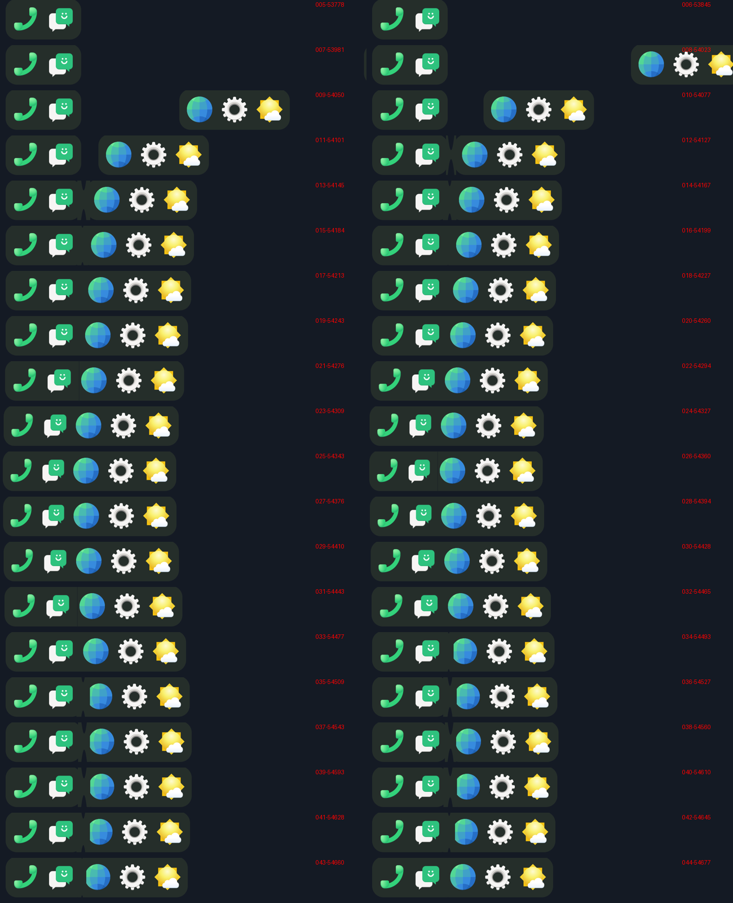

# Step 15: the dock's motion, as item's; windows through the hinge

item's dock (sfduo-dock's `_pane_path`, `_contact_ease`, `_spring`,
`_bump`, the neck phoc draws) in `dock.rs`.

## Contact

Meeting or parting, the last CONTACT_PX (24) of the crossing half's way is
taken at an even speed over the last 35 % of the time. It arrives moving,
and slowly (item's contact ease: a cubic Hermite into that speed, then a
line). Other moves are eased in and out as before.

## The bump

Meeting from apart, 420 ms more (SPRING_MS). The wave is
20 · e^(-1.5u) · sin(2πu):
- **the push (the wave above zero):** the half that stays is squashed
  against its screen edge, by up to 12 % of its width, and pushed on by up
  to 8 px. The arriving half follows its inner edge;
- **the rebound (below zero):** the arriving half is pulled away 1.6 times
  as far, a small gap opening;
- then it settles.

The squash scales the half's slab, icons and dots about its screen edge
(`Place::scale`, `anchor`): the textures are drawn at a smaller size.

## Corners and the neck

- **The inner corners** follow the gap between the halves' visible edges:
  square touching, round again from 8 px apart (MEET_ROUND). The slab is
  pre-drawn with inner radii 0, 4 … 20.
- **The neck:** closer than 14 px (half item's MERGE_PX), a neck of the
  slab's colour fills the gap and the corners' notches. Its top and bottom
  dip in the middle the wider the gap, and it breaks at 14. It is drawn as
  a small texture, remade when its size changes.
- **The slab is opaque now**, the colour item's translucent one comes out
  over the desktop's black, so the halves and the neck overlap without
  darker seams. A tucked half reaches 1 px under the other: no background
  line between them.

## Windows through the hinge

A window called to the other panel slides through the hinge as the dock's
halves do, as through a tunnel an icon long (`dock::lerp_x`): its edge goes
all the way in before any of it comes out.
