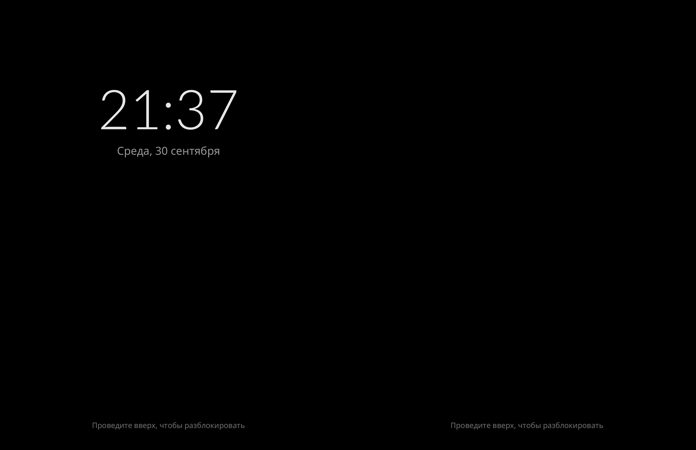

# Step 16: the power key, blanking, the lock screen, the volume keys

`compositor/src/lock.rs`, and `hybris_hwc::set_display_power`.

## What there is

- **The keys.** The power key (`qpnp_pon`) and the volume keys
  (`gpio-keys`) are opened with the touchscreen through libinput's path
  interface. logind leaves the power key alone on this port
  (`HandlePowerKey=ignore`, `10-droidian-power-key.conf`), so it is ours.
- **The power key, screen on:** the display is blanked (hwc2 power mode
  OFF: panel and backlight dark) and the phone locked. No frames are drawn
  while it is dark, and touches are ignored.
- **The power key, screen off:** it is lit again (power mode ON) on the lock
  screen. The first three frames are drawn whole
  (`Screen::reprime`), since hwcomposer may not show the first frame after
  power-on, as at start.
- **The idle delay** (org.gnome.desktop.session idle-delay, read at start)
  locks and blanks after that long without a touch. 0 is never.
- **The lock screen**, over everything:
  - black, with the time (Lato Light 110 px) and the date on the left
    panel, and "Проведите вверх, чтобы разблокировать" at the foot of both;
  - every touch is its own;
  - it rises and dims a little with the finger;
  - a swipe of 120 px or a fling up unlocks, and it fades out over 300 ms,
    as item's unlock (patches/phosh/0005).
- **The volume keys** step the volume by 5 %, locked or not.
- **Tests:** `touch /tmp/item-power` presses the power key.

**No PIN yet.** Checking one is PAM's (as phosh does), a step of its own.
Until then the lock screen only keeps pockets from touching.

## A run

The power key twice (the test hook), then a swipe up:

```
lock: locked
lock: screen off
lock: screen on
lock: unlocked
```

hwcomposer took both power modes. Whether the panel goes dark is to be
seen by hand.




## A session by hand, steps 15-16

180 s:
- Settings from the dock, the halves meeting;
- Settings put away;
- the volume keys down five times, 45 % to 25 %;
- the real power key: locked, screen off, screen on;
- a swipe up: unlocked.

Everything works, smoothly.
