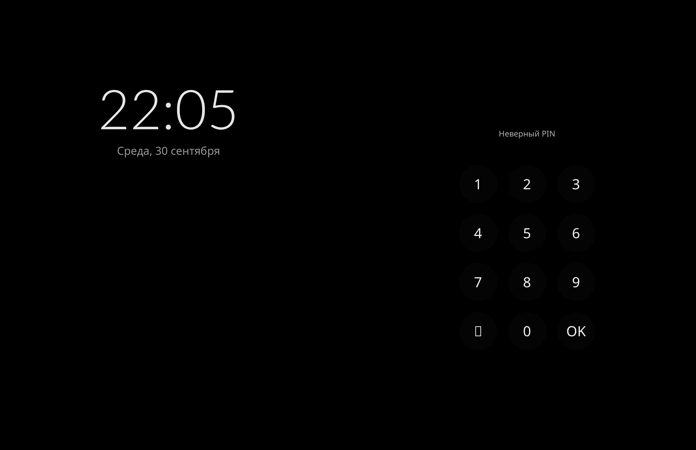

# Step 17: the PIN

The lock screen asks for the PIN (`compositor/src/pam.rs`, `lock.rs`).

## How

- A swipe up on the lock screen brings the PIN pad onto the right panel:
  - dots for what is typed, a line on what is going on;
  - keys 1-9 and 0, backspace (Adwaita's edit-clear, since the fonts have
    no arrow), OK.

  The time and the date stay on the left. A swipe down on the pad puts it
  away.
- OK checks the PIN as phosh checks it: PAM's `phosh` service (common-auth,
  pam_unix, which asks the setgid `unix_chkpwd` to check the user's own
  password, the PIN on the port), for the session's user.
- libpam is opened at run time (`dlopen`), since the cross build links
  against none.
- The check runs on a thread, since pam_unix waits about 2 s after a wrong
  PIN, and wakes the loop with the ping. Meanwhile the pad takes no keys
  and says "Проверка…".
- Right: the lock screen fades out as before. Wrong: "Неверный PIN", and
  what was typed is cleared.
- The PIN is never logged; the copy handed to PAM is zeroed after. The
  conversation answers PAM's prompts with a strdup that PAM frees.

## A run

Locked with the test hook, the pad brought up, "123" and OK typed by a
virtual finger:

```
pam: droidian: refused
```




The right PIN is to be tried by hand.
