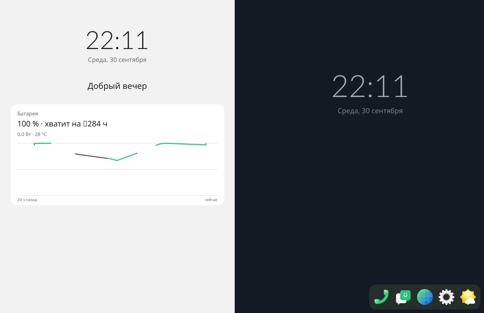
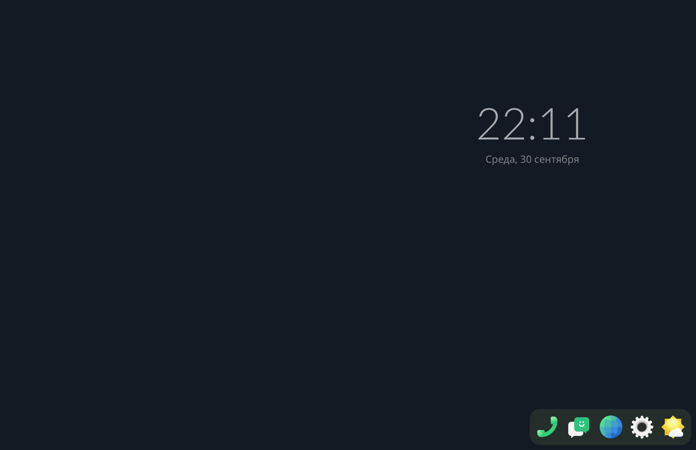

# Step 18: the lid, the pen, the system screen

The remaining features, to be tried together afterwards.

## The lid

`Surface Duo Lid Switch` is opened with the keys. libinput's switch event:
- **shut** (the Duo folded): the phone is locked and the display goes
  dark, as logind was told to do (`HandleLidSwitch=lock`);
- **opened:** it is lit, locked.

## The pen

`sfduo pen` (the port's split of the digitizer) is a touch of its own slot
(31, clear of the fingers'): tip down, moves while down, tip up. It taps,
drags and scrolls as a finger does, and works the shell's gestures too.

Input handling was rewritten for it (`input.rs`). Fingers, the pen, the
keys and the lid become `Contact`s, and one function takes them all.

## The system screen (`sysscreen.rs`)

item's #109 and #115:
- **Opening.** A swipe right on the left panel's desktop brings a page in
  from the left edge with the finger. Its background goes from the
  desktop's black to #F2F2F2, and the content appears over the last third.
  A swipe left on it takes it away. The release rules are the grid's: 0.3
  px/ms, 0.3 of the way, 220 ms × what is left.
- **The dock.** While it is out, the left panel counts as taken: the dock
  and the desktop clock go to the right panel.
- **The page:**
  - the time and the date;
  - a greeting by the time of day;
  - AccountsService's RealName as the name, unless it is the login, as
    here ("droidian");
  - the battery card: level and what it is doing, with UPower's estimate
    rounded as item rounds it (to 10 min, whole hours from 5 h, none
    beyond 48 h); "заряжен" for Full and for the port's "Not charging" at
    100 %;
  - power (current_now × voltage_now) and temperature;
  - the last 24 h from UPower's GetHistory: charging green, draining dark
    grey, broken at a gap.
- **Reading.** Nothing is read while it is closed. It is read on the way in
  and every 5 s while it is open, on a thread. The page is drawn into one
  texture when what it shows, or the minute, changes.

The first draw had a box for "≈" (the fonts lack it; now "~") and "хватит
на 284 ч" for a charged phone on its charger; both fixed.
