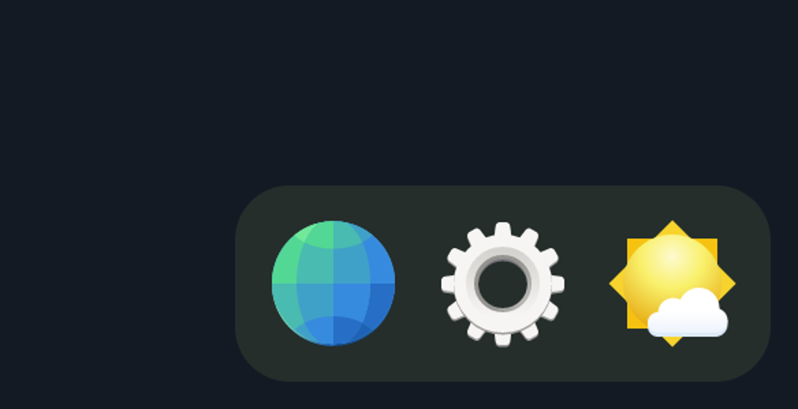
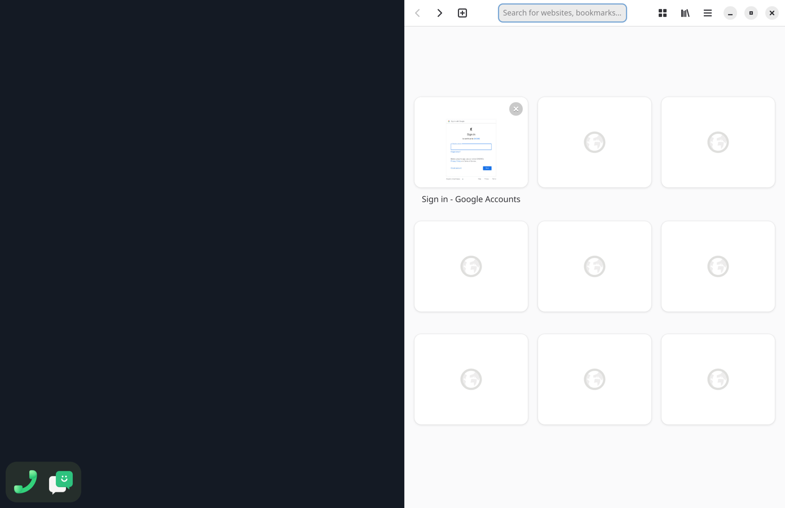
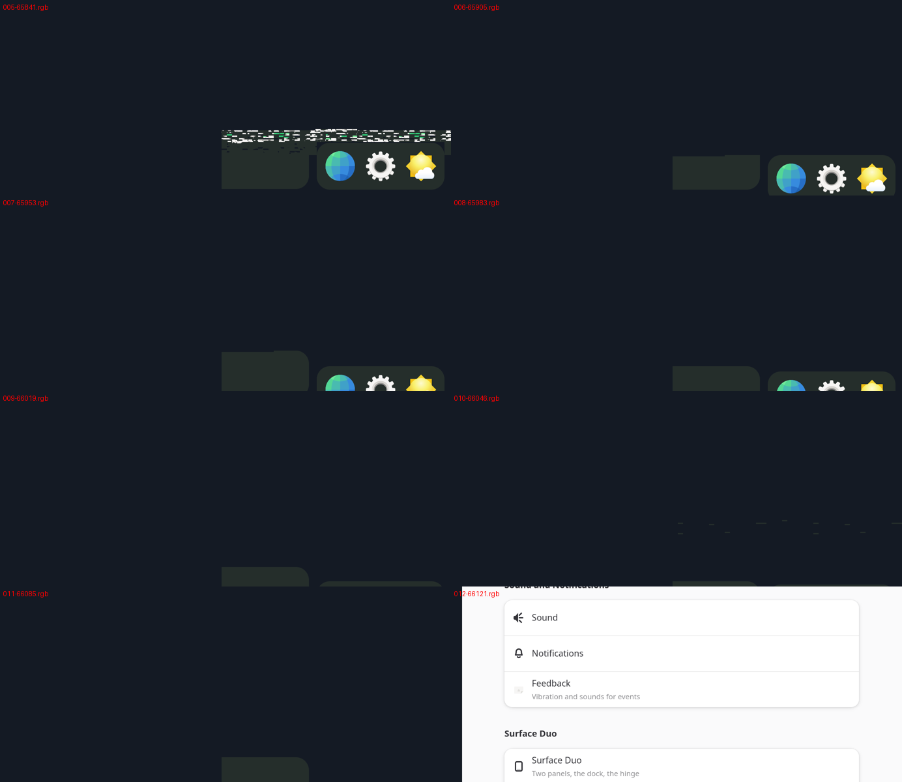
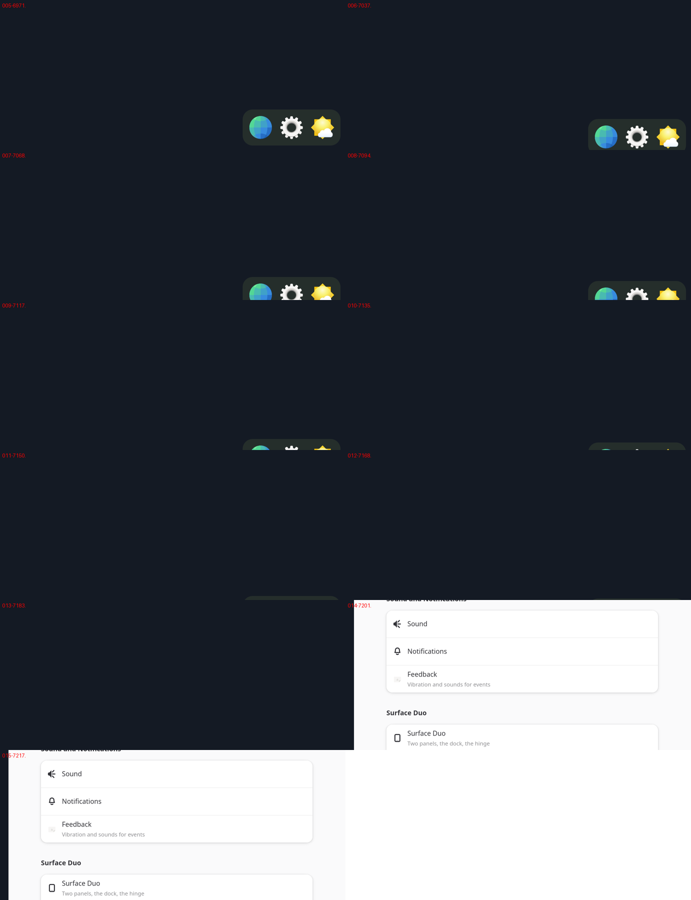
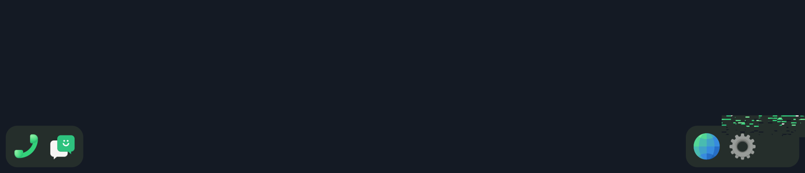
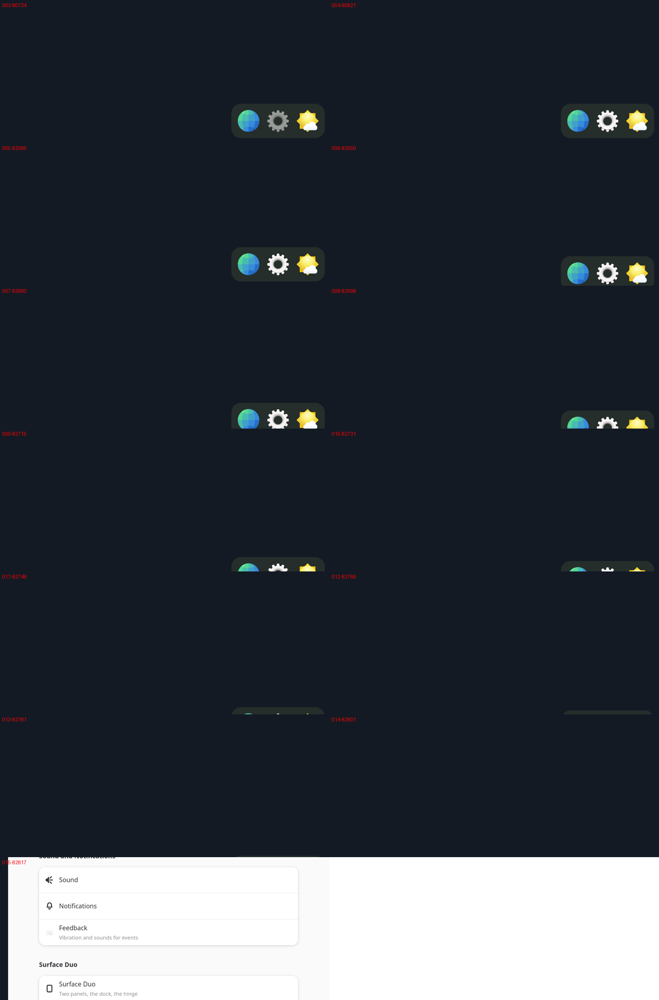

# Step 6: the dock, and what it turned up

item's dock drawn by the compositor (`compositor/src/dock.rs`): two
rounded slabs at the panels' outer bottom corners, the apps from item's
`~/.config/sfduo/dock.json`:
- left: Calls, Chats;
- right: Web, Settings, Weather.

A tap on an icon launches the app onto that panel. A half slides down out
of sight while a window has its panel, and comes back when the panel is
empty.

## How

- Icons come from the hicolor theme: SVG through resvg, PNG through
  tiny-skia. They are rasterized once at start, at the output's scale, into
  `MemoryRenderBuffer`s. The slab is a rounded rectangle drawn by
  tiny-skia. Everything is uploaded at start with the shade's text
  (`warm-up: 10 textures`).
- `Exec` comes from the desktop file, without field codes. It runs through
  `State::spawn`, and `launch_to` sends the next window to the tapped panel
  (within 10 s).
- The finger on an icon dims it (alpha 0.55). Moving 12 px off it is no
  longer a tap. The dock's touches never reach a client.
- Each frame the halves follow `panels_taken()`: a 260 ms slide, eased in
  and out.

 

## What it turned up

**A black screen with nothing moving.** hwcomposer does not show the first
frame after it powers the display on. Clients used to commit at once and
hide this. With only the dock nothing changed after the first frame, and
the screen stayed black. Every buffer now gets a frame at start
(`Screen::primed`).

**Epiphany aborted** (`Could not create GBM EGL display`). Clients were
started without the port's environment from `/etc/profile.d`
(`zz-droidian.sh`), which includes `WEBKIT_DISABLE_DMABUF_RENDERER=1` and
GLES for GTK. Clients now start through a login shell (`sh -lc`), as under
phosh. Apps started through D-Bus already had it in the user's systemd
environment.

**Screenshots and frame runs.** `touch /tmp/item-shot` saves the next
frame whole (`/tmp/item-shot-N.rgba`, RGBA, rows bottom-up).
`touch /tmp/item-frames` saves the next 40 frames as they went to
hwcomposer, the bottom 600 rows only, without forcing a whole redraw.
`tools/frames-run.sh X Y` taps (X, Y) with a virtual finger and collects a
run (`tools/tap-at.py`). The first screenshot crashed the compositor:
reading the frame back leaves the EGL surface no longer current, and the
swap failed (BadSurface). The frame is now copied before the swap and read
after it.

**Garbage around the dock** at launches, the dock torn. Frame by frame:
- A strip of scrambled icons appeared above the right half.
- A slab-coloured block moved with the dock.
- The icon next to a pressed one went missing.

With whole redraws the frames were clean
().

What was ruled out, one at a time:
- The buffers come in strict turn A B C (`LOG_BUFFERS=1`), so an age of 3
  is right.
- smithay's damage and the elements' positions are right, in screen
  coordinates (`LOG_DAMAGE=1`).
- Neither the icon's alpha nor GL instancing causes it (`INSTANCING=0`).

In the frame of the press, only the icon's 96x96 was damaged. That icon
was drawn right. The icon beside it, which was not damaged, was gone, and
garbage filled the tiles around it:

Adreno renders in tiles. It does not load a buffer's old contents into the
tiles it draws in, so outside the damage each such tile keeps whatever the
GPU last had there. Querying `EGL_BUFFER_AGE_EXT` makes some drivers load
the contents. Here it made things worse: whole tiles of garbage, and
windows drawn in pieces.

So every frame is now drawn whole. The damage tracker still decides
whether anything changed: if nothing did, there is no frame at all.
`PARTIAL=1` draws the damage only, for tests. The cost:

| | whole | damage only |
|---|---|---|
| shade benchmark: draw / swap | 2.9 / 3.9 ms | 2.4 / 3.0 ms (step 5c) |
| shade: finger to screen | 26.4 ms | about 24 ms |
| tap benchmark: draw | 3.6 ms | 3.0 ms |
| tap: touch to screen | 48 ms | 45 ms |

**The tap benchmark had tapped Clocks.** Clocks mapped first and took the
left panel, so the benchmark tapped an empty page. `bench.sh` now starts
Clocks 1.5 s after the calculator.

**Touch to screen is 45-48 ms, not step 4b's 39**, whole or partial. The
likely cause is step 5c's rule that draws the first frame after a pause at
the vsync, which gives up drawing late for sparse taps. Open.

**Scrolling Settings stutters a little.** The new `DRIVER=scroll` of
`bench.sh` scrolls item's Settings on the right panel. It commits 28-30
frames a second, and the compositor draws every one with no misses. The
client trace shows the cause:
- A buffer comes back 2 ms after the next commit.
- From our frame callback to the client's next commit takes 17-21 ms.

The app is slower than a frame whatever GTK's renderer (gl, ngl: 30 fps;
cairo: 23). The GPU stays at its lowest clock (257 of 585 MHz, 37 % busy):
the GPU is not what holds it back. It is the app, Python and GTK4, likely
on the CPU. Frame callbacks now go out before the frame is drawn (their
time is the vsync the frame aims for), which gives clients 8-9 ms more.
Sending them after is kept as `LATE_CALLBACKS=1`. It did not change this
app's 30 fps. Making textures at the commit, so buffers go back sooner,
did not change it either. It was dropped, because it could hand a client a
buffer the GPU still reads.

## By hand

Launching works. Chats opened too, on the left panel, although its service
belongs to phosh's session. The dock did not move: item's right half crosses
to the free panel and joins the left one when its panel is taken. That is
next.
