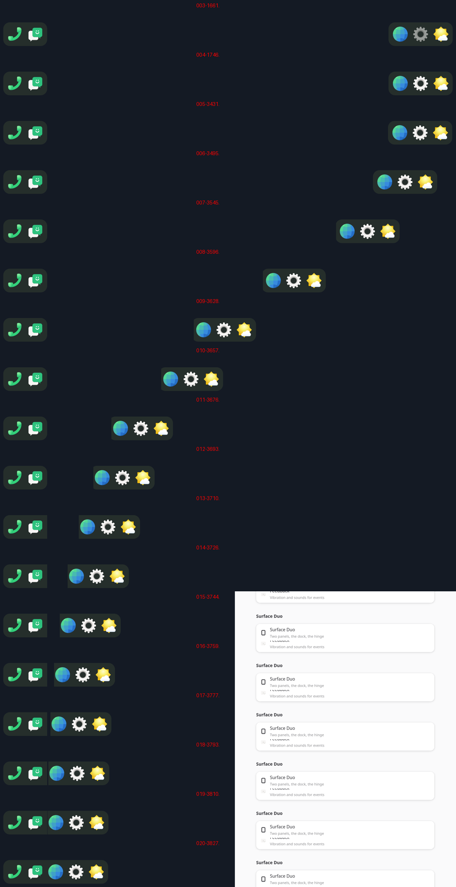
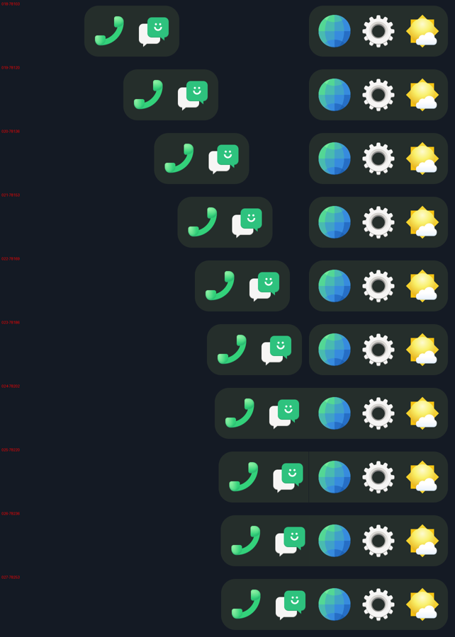

# Step 6b: the dock's halves move as item's do; clients' frames drawn at once

## The dock crosses to the free panel

The dock did not move. item's dock has four modes (sfduo-dock's
`_pane_targets`, `_pane_path`), and `dock.rs` now follows them:
- both panels free: each half at its panel's outer edge;
- one panel taken: side by side on the free one. The half whose panel it is
  stays where it stood; the other crosses and stands beside it;
- both taken: they dip below the bottom edge where they stand.

- A move takes 440 ms (MOVE_CROSS_MS), cubic ease in and out.
- The hinge is crossed as a tunnel an icon long (`_squeeze`, TUNNEL_PX):
  an icon goes all the way in before any of it comes out. The hinge's
  columns are not on the screen.
- Where the halves meet, the arriving half tucks its inner padding under
  (JOIN_TUCK, 10 px), so their icons stand GAP apart as within a half. The
  corners on that side are square. It tucks only as far as it would run
  over the other, so while apart it stays whole and round, and it squares
  up the moment they touch. Two slab textures per half, round and joined;
  the tuck is a crop of the texture (`src`).
- A tap launches onto the panel it was made on.

Frame runs of both crossings, as they went to hwcomposer:

## Responsiveness: drawing a client's frame at once

By hand it felt slower than phosh on Droidian 102; the aim is for
everything to move as the shade does. Settings, scrolled by a finger:

| | Settings' frames a second |
|---|---|
| under phosh (Droidian 102), `WAYLAND_DEBUG` on the client | 38-43 |
| ours, before | 28-30 |

phoc answers a commit with the frame callback about 3 ms later. The client
starts its next frame at once, a frame every 22-25 ms, and some of them are
never shown (`wp_presentation_feedback.discarded`). Ours sent the callback
at the next vsync's frame, half a frame later on average. Settings takes
15-20 ms a frame, so it missed every other vsync.

Now a client's commit is drawn at once: the frame callbacks go out as it
is drawn (step 6), and it shows at the next vsync. The shell's own motion
(the shade, the dock) is still drawn late, with the finger's latest place.

One rule keeps frames from queueing: nothing is drawn while the last
frame handed to hwcomposer has not had a vsync since (`Pacing::pending`).
A frame presented behind one still waiting blocks hwcomposer's present
until the vsync (step 5c). This replaces 5c's "skip a vsync after a missed
frame", and a client frame that comes too late for its vsync just shows at
the next one. A first try that drew at once without the rule gave 40-45
fps, but 15-22 misses a second queued and skipped. With a "time enough
before the vsync" test instead it fell back to 30 fps.

| benchmark | before | after |
|---|---|---|
| scroll Settings (`DRIVER=scroll`), its frames a second | 28-30 | 40-43 |
| tap the calculator, touch to screen | 45-48 ms | 31.7 ms |
| the shade, finger to screen | 26.4 ms | 27.1 ms |

`ASAP=0` waits for the vsync as before. `draw` in the report is now split:
`elements` is gathering the elements, clients' buffers made textures.

After 120 s by hand: good, with room to improve.
