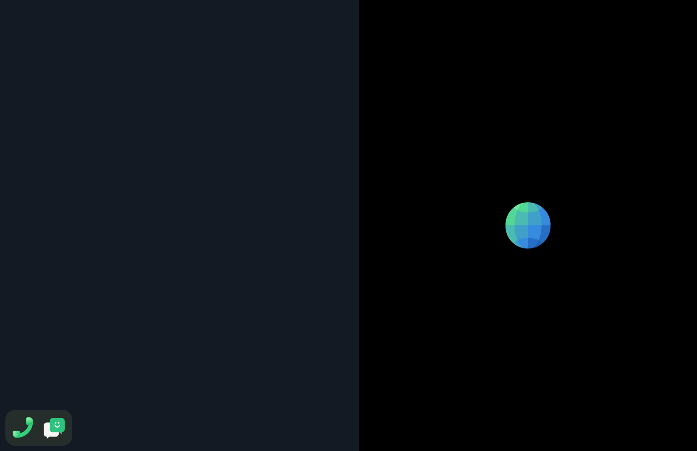
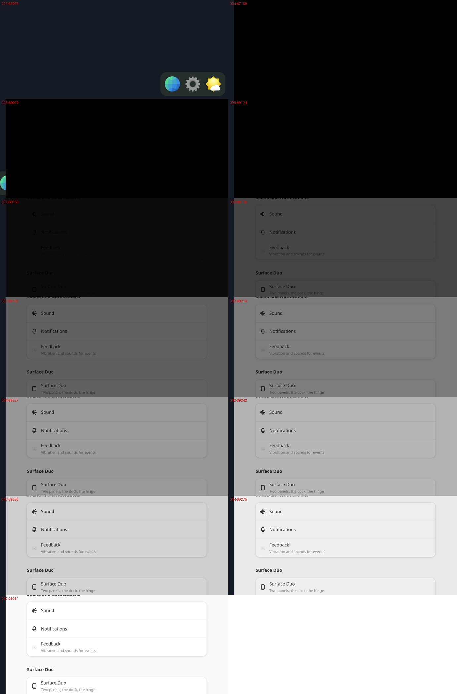
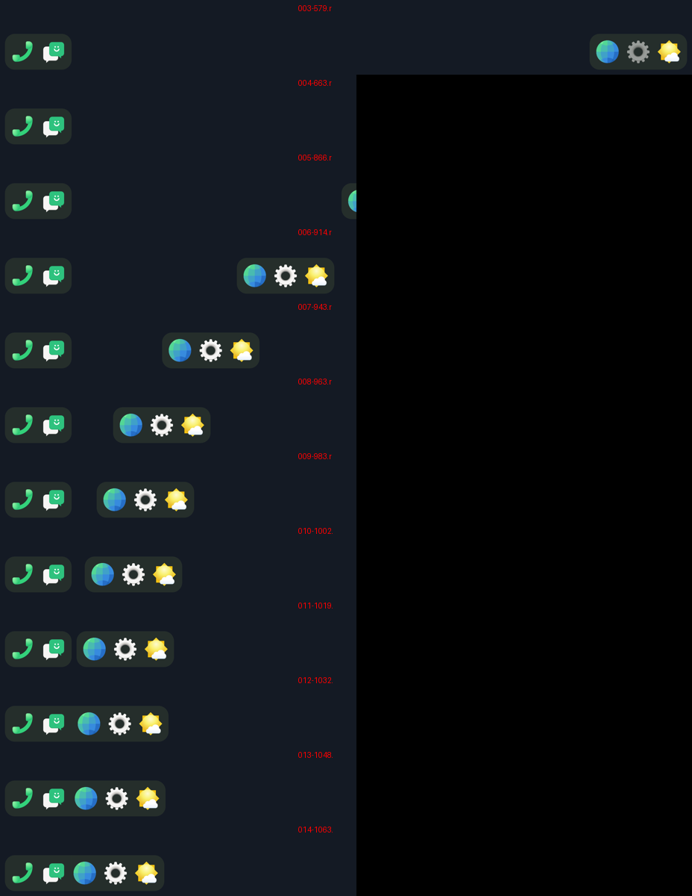

# Step 8: the launch curtain

item's launch curtain, drawn by the compositor (`compositor/src/curtain.rs`).
From the tap on a dock icon until the new window's first frame, the panel
the app goes to is black, with the app's icon in the middle (96 logical px,
item's CURTAIN_ICON). The other panel stays as it was.

An app takes 1.5-2.5 s to show a window. Before, nothing answered the tap
in that time but the dock sliding away. Now the curtain is up in the next
frame.

- The curtain is up at once. It fades out over 150 ms when the launched
  app's window commits its first buffer. The window is the one mapped on
  that panel after the launch (`Curtain::adopt`). With no window, the
  curtain lifts after 20 s (item's WAIT_TIMEOUT).
- The icons at the curtain's size are rasterized at start with the dock's.
- The order in a frame: the shade, the curtain, the dock, the windows. The
  dock's half leaves under the curtain.
- The GPU boost holds while it fades.

A virtual tap on Settings: the curtain up with the release, the window
drawn 2.01 s later, then five frames of fade:

Epiphany: drawn 2.54 s after the tap.

## The dock leaves at the tap

Smooth, but the dock should move at once, not wait. It used to wait for the window to map, 1-2 s
after the tap. Now a panel under a launch curtain counts as taken
(`Curtain::panel`), so the half sets off in the frame after the curtain
goes up. If no window comes, the panel is free again when the curtain
lifts, and the dock comes back.

