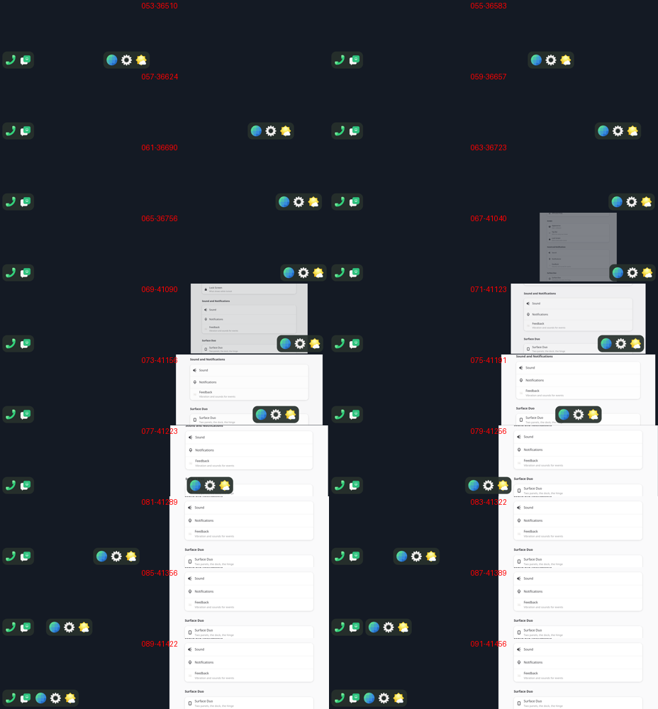

# Step 9: a swipe up puts a window away

item's bottom band (sfduo-dock, EDGE 36 px) with phoc's minimize motion,
drawn by the compositor (`compositor/src/gesture.rs`).

- A touch in the bottom 36 logical px of a panel with a window belongs to
  the gesture; the window gets none of it.
- The window follows the finger: p is the travel up over 320 px. It
  shrinks toward 0.3, its bottom settling 12 px above its old bottom edge,
  and fades (alpha 1 - p²), as phoc's 280 ms motion.
- The window is drawn with smithay's `RescaleRenderElement` inside a
  `RelocateRenderElement`. The windows are now drawn by the compositor,
  topmost first, instead of through `space_render_elements`.
- On release:
  - faster than 0.3 px/ms up, it goes away;
  - faster than 0.3 px/ms down, it comes back;
  - otherwise it goes away past 0.3.

  The rest of the way takes 280 ms × what is left, easing out. item
  commits on any 12 px of travel and does not follow the finger.
- Put away, the window leaves the space for `State::put_away`, with its
  panel; the keyboard goes to what is on top. Its panel counts as free as
  soon as it sets off away, so the dock comes back with the motion, not
  after it.
- A tap on its app in the dock brings it back onto the tapped panel, the
  motion reversed, with no curtain and no launch. The dock item's ids are
  the desktop file's name and StartupWMClass; windows give theirs as the
  app id (logged at the first buffer: Settings is `org.sfduo.Settings`).
- `tools/touch-script.py` plays a script of taps and drags; with
  `tools/script-run.sh` it runs a session and collects 40 frames. The run
  here opened Settings from the dock, swiped it away, and tapped it back:

Not yet: apps not in the dock cannot be brought back (the app grid is
next), and there is no running dot in the dock.
