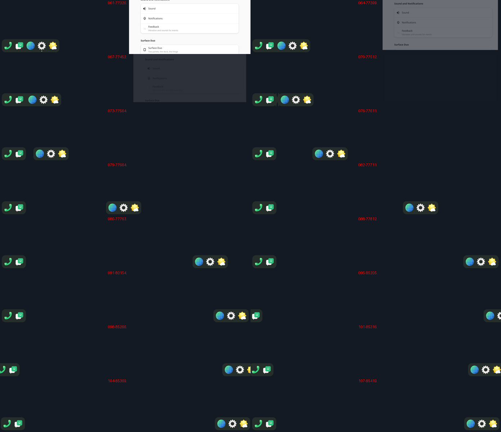

# Step 19: a window's close, the volume bar, the dock's rise after an unlock

## A window's close

item's close motion (phoc's): 200 ms, easing out, the window shrinking to
0.92 about its centre and fading. By the time the toplevel is destroyed
its surface may be gone. So each frame, every window's main surface
texture is kept (a `GlesTexture` clone, cheap: it is shared)
with where it stood and its size (`Screen::snapshots`). On
`toplevel_destroyed`, that last frame is drawn closing as a smithay
`TextureRenderElement`, whose alpha and size can be set. The last frames
of windows gone and done closing are dropped.

## The volume bar

item's upright bar beside the keys:
- 12 × 220 px, at the right panel's right edge near its top, where the
  Duo's volume keys are;
- white fill from the bottom by the volume;
- up 1.5 s after the last press, then fading over 200 ms.

**A mistake on the way.** A test hook stepped the volume up and down from
the compositor's own idea of it. It had not been read yet, so it was 0,
and the phone's volume was set to 0 %; it was set back to where it had
been, at once. The same would have happened on the first
press of a real key. A step now reads the volume as it is on the quick
settings' thread, then sets it 5 % up or down. The hook is gone.

## The dock's rise after an unlock

item's #72: the dock's halves come in from the screen's sides, 360 ms
easing out, 250 ms after the unlock begins (RISE_MS, RISE_DELAY_MS). It is
laid over the dock's own path (`Dock::rise`). `touch /tmp/item-rise`
starts one, for tests.

