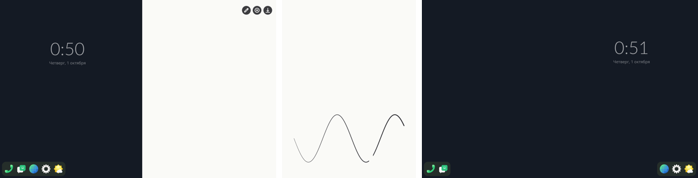

# Step 20: the pen's sheet

item's `sfduo-pen-screen`, in the compositor (`pensheet.rs`): a page right
of the right panel, the system screen's mirror.

- A swipe left on the right panel's desktop brings it in with the finger
  (`grid::Ask::Pen`); a swipe right on it takes it away. Flick or past
  30 %, as the system screen. While it is out the right panel counts as
  taken, and the dock leaves it.
- Only the pen draws; fingers do not. The pen's pressure sets the line's
  width, 2 to 8 physical px, eased from point to point so a line does not
  step. Its other end (libinput's eraser tool), its barrel button held, or
  the eraser picked in the toolbar erases, 40 px wide.
- The toolbar at the top right: pen or eraser (lit blue while erasing),
  clear, save. Save writes a PNG of the sheet on a thread, to
  `~/Pictures/Sketches/sketch-YYYY-MM-DD-HHMMSS.png`.
- What is drawn stays while the compositor runs.

The sheet is one 1350 × 1800 texture in memory. A segment of a stroke is
drawn into that memory with tiny-skia, and only its bounds go to the GPU
as damage (smithay's `MemoryRenderBuffer` uploads damaged rectangles), so
a line costs kilobytes a frame, not the sheet's 10 MB. The sheet is made
and uploaded in the warm-up, not on its slide's first frame.

The pen's events go to the sheet only when it is fully out and the pen
touches down over it; a stroke begun there stays the sheet's until the
tip comes up. Anywhere else the pen is still a finger (step 18).

## A missed frame, for the system screen too

The dock learns a panel is free only on a frame. When the sheet (or the
system screen) finished sliding away, the frame that ended the slide was
the last, so the dock stayed joined on the other panel until something
else drew. The frame that ends a slide now asks for one more.

## Tests

With the virtual touchscreen (`tools/script-run.sh`): the swipe in, the
toolbar's taps, the save and the swipe out. The pen cannot be played
from uinput here, so `touch /tmp/item-stroke` draws a wave on the open
sheet, its pressure rising from 0 to 1, and erases across its right
third with the pen's other end. The saved PNG was the sheet as drawn
(the test file was removed from the phone). Not yet tried with the pen
itself.

